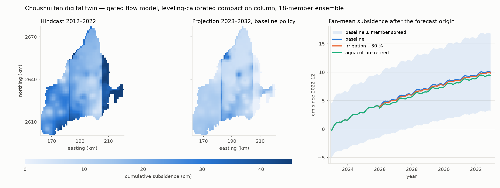

# HydroPhysicsAI

**A differentiable digital twin of the Choushui alluvial fan, Taiwan: pumping policy in, groundwater heads and land subsidence out, gated against held-out data at every stage.**

[](https://github.com/Rekin226/HydroPhysicsAI/actions/workflows/ci.yml)
[](https://www.python.org/)
[](#how-it-works)
[](LICENSE)

[Project state](docs/superpowers/STATE.md) · [Data](docs/DATA_FORMAT.md) · [Technical writeup](docs/TECHNICAL_WRITEUP.md) · [Model card](MODEL_CARD.md) · [Earlier phase](docs/EARLIER_PHASE.md)



---

## Overview

The Choushui fan is Taiwan's largest groundwater basin and its most serious subsidence
problem: unmetered irrigation pumping from four stacked aquifers, and a ground surface
sinking centimetres a year under the high-speed-rail corridor.

This repository is a physics-based twin of that system. A four-layer groundwater solver
on a 1 km grid is driven by the registered-pump electricity census and rain-minus-ET
recharge, coupled to a visco-elasto-plastic compaction column, and calibrated by gradient
descent through the solver's own adjoint. It takes a pumping policy, runs the aquifer
forward, and animates where and how fast the ground sinks, with a parameter ensemble
around every number.

```
pumping policy ──▶ flow solver ──▶ layer heads ──▶ compaction column ──▶ subsidence ──▶ 3D viewer
```

## Results

| | gate | result |
|---|---|---|
| **Flow model** | held-out wells, 5 site-grouped folds, must beat inverse-distance interpolation | **PASS**, R² +0.804 vs +0.702, with a physical pump conversion and a learned stress radius |
| **Compaction column** | 798 leveling benchmarks, site-grouped 5-fold | **+0.546** out of fold, bias +0.1 cm |
| **Full chain hindcast** | 798 leveling sites, 18-member ensemble | R² **+0.526**, RMSE 6.6 cm |
| **Projection 2023–2032** | fan-mean subsidence ± ensemble | 10.0 ± 1.3 cm baseline · 9.5 ± 1.1 cm with aquaculture retired |
| **Re-run cost** | 18 members × 3 policies × 21 years | 609 s on one GPU; FNO surrogate 13–34× faster again |

Every verdict, including the two failed configurations that preceded the pass, is
recorded in [`docs/superpowers/STATE.md`](docs/superpowers/STATE.md).

**Two caveats govern the policy numbers.** First, the flow gate holds out *wells*: it
validates spatial interpolation under the recorded forcing. A gate that holds out
*years* (fit to 2019, free-run 2020–2022) finds that the model's own dynamics drift
within three years, worse than climatology on per-well anomalies. Projections are
therefore anchored by nudging to observations at the origin, and their decade-scale
trend is the model's, not yet validated. Second, the gated model's pumping stress is
physical (efficiency 0.5, 40 m extra head, irrigation return flow) only because each
cell's electricity is spread over a learned radius that sits at its 10 km bound; the
earlier free fit passed by switching the stress off. Both are stated with numbers in
the state doc.

## Data

All real, on the 2,144 km² fan, 2012–2022, monthly. Only a synthetic sample ships with
the repository; the cache is rebuilt from the WiseEnvr API with
`hydrophysics.twin.fetch_amp` (credentials from the environment only).

| source | size | role |
|---|---|---|
| Water Resources Agency monitoring wells | 174 wells, 4 aquifers, hourly | heads: calibration target and assimilation |
| Taiwan Power Company pump census + electricity | 116,769 pumps, 26 M meter-months | abstraction forcing |
| Rain gauges + ERA5 ET₀ | 26 gauges, daily | recharge |
| Leveling benchmarks | 798 sites, 7,539 surveys | subsidence calibration and validation |
| Multi-layer compaction wells | 14 sites | independent compaction check |

## Quickstart

```bash
pip install -e ".[gpu,viz,explorer,dev]"
export HYDROMIND_GW_DATA=$PWD/chou-shui-data/data

# calibrate the flow model and run its gate (GPU, ~35 h)
python -m hydrophysics.twin.calibrate_flow --param-mode zonal --epochs 500 --n-folds 5 \
    --device cuda --compile-matvec --out results/twin_runs/my_run

# calibrate the compaction column on the gated heads (leveling target)
python -m hydrophysics.twin.calibrate_coupled --theta results/twin_runs/my_run/stage3_theta.json \
    --target leveling --configs shared,zonal --out results/twin_runs/my_run/coupled

# run a policy forward with the fold ensemble, and render it
python -m hydrophysics.twin.forward --theta results/twin_runs/my_run/stage3_theta.json \
    --theta results/twin_runs/my_run/stage3_fold_thetas.json \
    --scenario "cut30:irrigation=0.7@2026-01" --horizon 120 \
    --vep-json results/twin_runs/my_run/coupled/vep_zonal_leveling.json --out results/twin_forward/cut30
python -m hydrophysics.twin.explorer3d --forward-npz results/twin_forward/cut30.npz \
    --out results/twin/explorer3d_forward.html
```

`pytest -q` runs the test suite on CPU in about 13 minutes.

## How it works

- **Solver.** Five-point finite volume, backward Euler, four aquifers with leakance between
  them, general-head boundaries on the coast and the mountain front. The linear solve is
  matrix-free conjugate gradient in float64; gradients come from an implicit-function
  adjoint, so memory does not grow with the rollout.
- **Forcing.** Electricity converts to abstraction through the pump's own hydraulics, with
  the lift taken from the model's evolving head. The census is de-duplicated across shared
  meters and screened against rated motor capacity. Recharge is rain minus ET₀.
- **Calibration and gates.** Zonal parameters (proximal, mid, distal) fitted by Adam
  through the adjoint. The flow gate is site-grouped k-fold against inverse-distance
  interpolation; the column gate is site-grouped k-fold over the leveling network.
- **Forward twin.** Hindcast, observation nudging at the forecast origin and optionally
  through the record, climatological forcing under named policies, and an ensemble over
  fold fits, Laplace-posterior draws and perturbed initial fields.
- **Surrogate.** A PhysicsNeMo Fourier neural operator trained on the calibrated solver,
  for policy sweeps and large ensembles.

Modules live under `hydrophysics/twin/`; each file's docstring states what it does and
why. Hardware notes and stack decisions are in `docs/GPU_SERVER.md`.

## Limits

- A free-running continuation drifts within three years (held-out-years gate: RMSE
  6.6 m at the wells against 2.0 m for climatology), so the twin is a hindcast-and-nudged-
  projection tool, not a free forecaster. Fitting anomalies rather than levels is the next
  calibration change.
- The spread radius of the pumping stress sits at its 10 km bound in every fold; the
  bound is being raised and re-gated. Policy sensitivities are consequences of a gated
  model, not validated forecasts of a policy's effect.
- The mid-zone viscous time constant reaches the length of the record; decadal creep is
  bounded by the calibration window.
- The posterior is a local Laplace approximation; parameters at a bound are held, not
  sampled.

## Earlier phase

The project began (2026-06) as a benchmark of one physics-informed neural operator across
61 curated wells against per-well gray-box ODEs, with an assimilated forecaster, a PINN
head field and a 2D explorer. That work is kept in full in
[`docs/EARLIER_PHASE.md`](docs/EARLIER_PHASE.md). It is no longer the headline: the twin
runs on a denser, layer-resolved dataset with the pumping forcing and the subsidence
network the operator benchmark never had, and its gates are physical rather than a
comparison with a baseline scored elsewhere.

## Repository

```
hydrophysics/twin/       the twin: grid, boundaries, flow, pumping, compaction, calibration,
                         forward, uncertainty, surrogate, explorer3d, fetch_amp
hydrophysics/            earlier-phase models, baselines, metrics, forecaster, explorer
docs/superpowers/        design specs, plans and the state ledger
results/twin/            published gate results and the rendered viewer
tests/                   CPU-only test suite
```

## Contributing

Contributions are welcome. See [CONTRIBUTING.md](CONTRIBUTING.md) for the dev setup,
the GPU install and the evaluation rules, and the
[issues](https://github.com/Rekin226/HydroPhysicsAI/issues) for claimable work.

## Author and license

Abdoul Rachid Ouedraogo, Ph.D., hydrogeology and AI. Also: [AquaScope](https://github.com/Rekin226/aquascope).
MIT, see [LICENSE](LICENSE).
