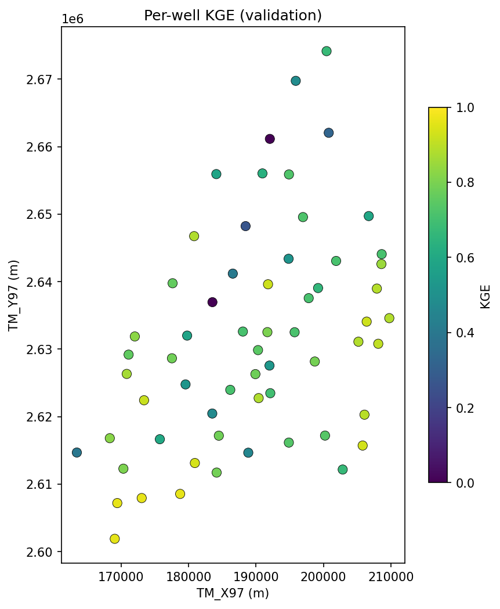
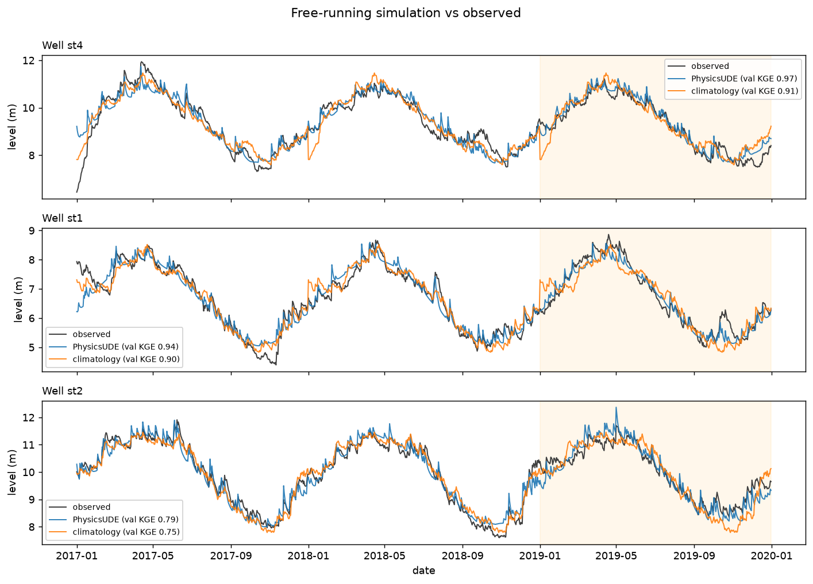
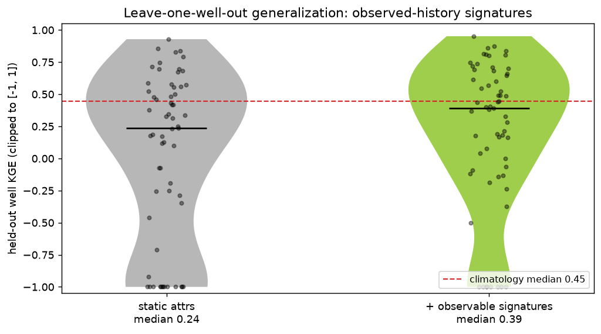
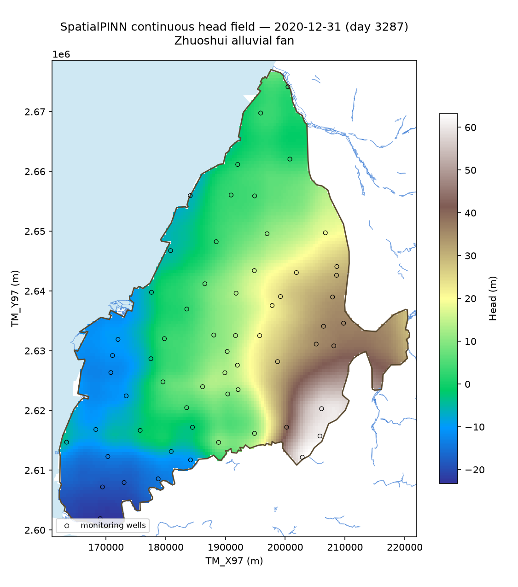
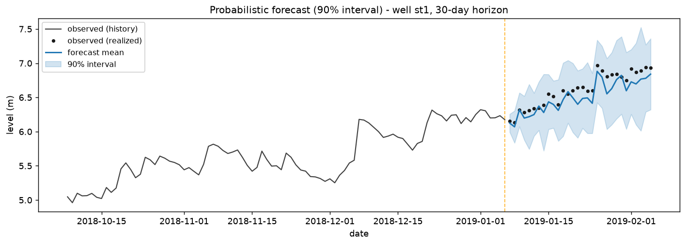
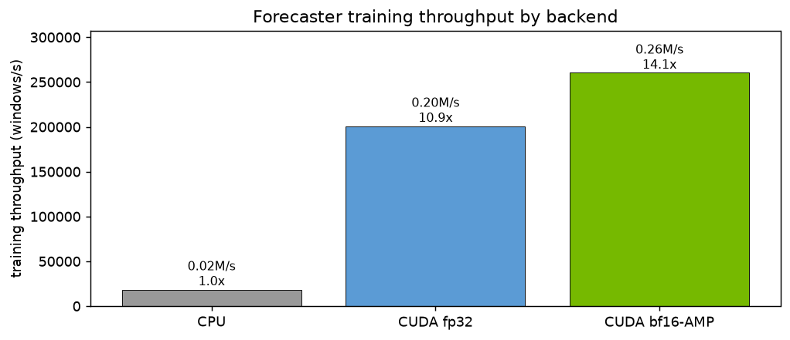

# HydroPhysicsAI

**GPU physics-informed neural operators for groundwater — one model across many wells, benchmarked against per-well gray-box ODEs.**

[](https://github.com/Rekin226/HydroPhysicsAI/actions/workflows/ci.yml)
[](https://www.python.org/)
[](LICENSE)
[](#nvidia-gpu-path)
[](https://huggingface.co/spaces/Rekin226/HydroPhysicsAI-demo)

**[▶ Live demo](https://huggingface.co/spaces/Rekin226/HydroPhysicsAI-demo)** · **[Model card](MODEL_CARD.md)** · **[Technical writeup](docs/TECHNICAL_WRITEUP.md)**

---

## Results at a glance

All on the real 61-well Zhuoshui data, out-of-sample validation from 2019. Median KGE (higher is better) unless noted.

| Task | This repo | Reference | Verdict |
|---|---|---|---|
| **Simulation** (free-running hindcast) | physics-UDE **0.754** (recharge-memory + ET; 0.591 baseline) | gray-box 0.736 · climatology 0.446 | one shared operator reaches/exceeds the gray-box class |
| **Generalize to unseen wells** (leave-one-well-out) | **0.565** (attr-only 0.236) | climatology 0.446 · in-sample 0.591 | now beats climatology, nearly matches in-sample |
| **Forecast, 7-day** (operational, assimilated) | LSTM **0.965** | persistence 0.946 | real skill over persistence |
| **Forecast, 30-day** | LSTM **0.899** | persistence 0.703 | nearly halves the error |
| **Forecast, probabilistic** | CRPS beats persistence, ~90% calibrated | — | sharp, well-calibrated intervals |
| **GPU training** (mixed precision) | **14×** over CPU, ~½ the memory | fp32 10.9× | real NVIDIA-stack speedup |
| **NVIDIA PhysicsNeMo port** | KGE **0.591** (`ude_nemo`) | PyTorch UDE 0.591 | runs on the framework, identical skill |
| **Per-well signal decomposition** (simulation) | **0.75** | gray-box 0.736 · UDE 0.591 | reaches the gray-box accuracy class |

Simulation and forecast modes are scored **separately** and are not comparable (forecasting with assimilation is a different, easier task). The headline scientific challenge — one attribute-conditioned operator generalizing to wells it never saw — is the leave-one-well-out row. Conditioning on observable signatures of a held-out well's history, pinning its free-run equilibrium to its observed mean, and gating on self-consistency lift it from 0.236 to **0.565 — above climatology (0.446) and near the in-sample 0.591** (see [Generalizing to unseen wells](#generalizing-to-unseen-wells)).

## The idea

Classical hydrology calibrates **one ODE per well**: 33-61 separate parameter fits, each blind to the others. HydroPhysicsAI trains **a single physics-informed neural operator across all wells at once**, conditioned on each well's static attributes, on the NVIDIA GPU stack (PyTorch / PhysicsNeMo / CUDA). It is scored in true **simulation mode** (free-running hindcast from an initial condition + forcing, never seeing observed levels) against the per-well gray-box ODE baseline.

> One GPU-trained physics-ML operator, across all 61 wells, aiming to match or beat 61 hand-calibrated ODEs — and run in milliseconds, generalize to wells it never saw, and carry calibrated uncertainty.

Test bed: 61 groundwater monitoring wells on the Zhuoshui alluvial fan, Taiwan, 2012-2022, validated out-of-sample from 2019.

## Why physics-informed, not a black box

The model keeps the gray-box mass-balance ODE (recession + rainfall + upstream coupling + seasonal terms) as its inductive bias, and learns a neural **hypernetwork** that maps well attributes to the ODE parameters. So it stays interpretable (read off `a`, `b`, `k_link` per well), extrapolates better than a pure sequence model, and amortizes: one network conditions on attributes, so it can predict a well it was never calibrated on. That leave-one-well-out generalization is the operator-learning headline.

## Benchmark (simulation mode, validation period)

The bar to beat, computed by the harness in this repo:

| Model | KGE (median) | NSE (median) | RMSE m (median) | Wells |
|---|---|---|---|---|
| **Gray-box ODE** (per-well calibrated, baseline) | **0.736** | — | 0.83 | 61 |
| Climatology (per-well seasonal mean) | 0.446 | -0.20 | 1.63 | 61 |
| Last-value (constant) | undefined* | -0.57 | 1.83 | 61 |
| Physics-informed neural operator (baseline) | 0.591 | 0.49 | 1.07 | 61 |
| **+ rainfall recharge-memory** (this project) | **0.704** | **0.57** | **0.95** | 61 |
| **+ evapotranspiration driver** (this project) | **0.754** | **0.60** | **0.81** | 61 |

<sub>*A constant prediction has zero variance, so KGE is undefined; skill is read from NSE/RMSE. Forecast-mode persistence scores KGE 0.997 but is deliberately excluded: 1-step-ahead prediction of slow-moving groundwater is trivial and not comparable to a free-running simulation. The harness keeps simulation and forecast modes separate so the comparison stays honest.</sub>

The operator is one network across all 61 wells (attribute-conditioned hypernetwork to ODE parameters, level anchored to each well's training mean, per-well-weighted data + physics-residual loss, 1500 epochs on CUDA). The original instantaneous `b·rain` recharge term underfit the response — aquifers integrate rainfall over weeks to months — so we replaced it with **multi-timescale recharge memory**: the hypernetwork predicts one gain per causal memory state `api_k[t] = decay_k·api_k[t-1] + rain[t]` (decays 0.99/0.95/0.85 ≈ 100/20/6-day timescales). That single change lifts the operator from **0.591 to 0.704 median KGE** (NSE 0.49→0.57, RMSE 1.07→0.95, better on every metric), so **one shared, amortized operator now nearly matches the 61 hand-calibrated gray-box ODEs (0.704 vs 0.736)** — the gap closed from 0.145 to 0.032. The memory timescales were selected on an inner pre-2019 split (inner-train <2018, inner-val 2018); the 2019+ benchmark was scored exactly once, and the baseline reproduces at 0.591. Reproduce: `python -m hydrophysics.train --model ude --rain-memory 0.99,0.95,0.85 --epochs 1500`. (The ingredient is borrowed from the per-well [decomposition](#per-well-signal-decomposition--reaching-the-gray-box-accuracy-class) below, now folded into the shared operator.)

### Adding the missing driver: evapotranspiration

Recharge is rainfall *minus* evapotranspiration, but the model only saw rainfall — so it could not explain ET-driven decline. We add the other half: **net recharge = rain − ET₀**, where daily FAO-56 ET₀ comes free (no API key) from Open-Meteo/ERA5 at each well, fetched via the [AquaScope](https://github.com/Rekin226/aquascope) toolkit. That lifts the operator from **0.704 to 0.754 median KGE** (NSE 0.57→0.60, RMSE 0.95→0.81, beats climatology on 58/61 wells) — now **at or above the gray-box's reported 0.736**. Strikingly, the out-of-sample gain (+0.050) is *larger* than the inner-split gain (+0.016) for a physical reason: the 2019+ window contains Taiwan's record **2020–2021 drought**, where decline is ET-driven and a rain-only model is blind — so the ET driver helps most exactly when prediction is hardest. The subtraction coefficient was selected on the inner 2018 split; 2019+ scored once; the control reproduces at 0.704. Reproduce: `python -m hydrophysics.train --model ude --rain-memory 0.99,0.95,0.85 --et --epochs 1500` (uses the committed ERA5 ET₀ cache; no fetch needed).



*Per-well validation KGE (gray-box baseline) over the real study area — the Zhuoshui alluvial-fan outline, rivers, and coastline (from the project shapefiles, TWD97). Each dot is a station at its true coordinates, colored by validation KGE; most wells are well-modeled (green/yellow), the dark wells are the hard cases a single attribute-conditioned operator should rescue. Reproduce: `python -m hydrophysics.maps --kge`.*



*Free-running PhysicsUDE hindcast vs observed, validation period shaded. Generated from the bundled **synthetic sample** (`python -m hydrophysics.figures`) so the figure reproduces anywhere and ships no real agency series; the same command on real data redraws it for the 61 wells.*

## Per-well signal decomposition — reaching the gray-box accuracy class

A different angle on the simulation task: instead of predicting the raw level, **decompose each well's signal and model the components** — `level(t) = harmonic seasonal + (damped) trend + forcing-driven anomaly + anchor`, where rainfall enters through multi-timescale exponential recharge-memory filters and upstream as a lagged term (ridge-fit on the training residual). Every component is fit on training days only and projected from known forcing, so it is scored in the same leakage-free simulation mode as the gray-box.

| Model (2019+, simulation mode) | median KGE |
|---|---|
| climatology | 0.446 |
| physics-UDE operator (baseline) | 0.591 |
| **decomposition** (per-well) | **0.75** (no-trend variant 0.78) |
| gray-box ODE (reported) | 0.736 |
| physics-UDE operator + recharge-memory | 0.704 |

Its winning ingredient — multi-timescale rainfall recharge-memory — is exactly what we then folded into the shared operator above (lifting it 0.591 → 0.704). So the per-well experiment both reaches gray-box accuracy *and* points the way to improving the headline operator.

This lands in the **same accuracy class as the gray-box** and is well above our UDE and climatology on the identical harness. It is *not* a head-to-head win over the gray-box — that 0.736 is from the original project's own evaluation and is not re-scored here — and it is a **per-well** model (the gray-box's class), not the shared operator, so it answers "how accurately can we simulate?", not "does one operator generalize to unseen wells?". Verified leakage-free: corrupting every validation value leaves predictions unchanged (`tests/test_decomp_smoke.py`). Reproduce: `python results/decomp/final_benchmark.py`.

## Generalizing to unseen wells

The operator-learning headline: train on N−1 wells, then predict a **held-out** well that was never calibrated (k-fold, every well held out once, scored on 2019+). The gray-box can't do this at all — it fits one parameter set per well and has nothing to say about a new one.

Three steps took the held-out-well median KGE from 0.236 to **0.565** — past climatology (0.446) and within reach of the in-sample operator (0.591). Each step was selected on an inner 2018 split; the 2019+ numbers were scored exactly once.

**Step 1 — condition on observed behavior, not geography** (0.236 → 0.389). The raw station data carries no hydrogeology (just coordinates), so geographic attributes alone are weak. But a held-out well still has a monitoring *history*, so we summarize it into six physically-meaningful signatures (lag-1 autocorrelation → recession rate, rainfall sensitivity → recharge gain, upstream coupling → `k_link`, seasonal amplitude, level spread, trend), all from training days only.

**Step 2 — pin the equilibrium** (0.389 → 0.491). Diagnosing the wells that still failed showed they free-run to the *wrong level*: their predicted equilibrium sat 5–15 m off the well's actual mean, because the operator had free degrees of freedom in the absolute level. The fix is physical — pin each well's free-run equilibrium to its observed mean (the anchor, available for held-out wells) and let the ODE model only *deviations* driven by rainfall/upstream anomalies and season. The operator alone now **beats climatology** (0.491 vs 0.446, head-to-head on 62% of wells).

**Step 3 — gate on self-consistency** (0.491 → 0.565). Trust the operator only on wells where it can reproduce *their own training history* (free-run training-period KGE ≥ τ, τ=0.3 selected on the inner split, leakage-free), else fall back to climatology.

| LOWO method | median KGE | clipped-mean | beats climatology per-well | wells KGE<0 |
|---|---|---|---|---|
| climatology (reference) | 0.446 | 0.332 | — | 5 |
| static attributes only | 0.236 | — | 22 / 61 | 23 |
| + observable signatures | 0.389 | 0.207 | 28 / 61 | 18 |
| + equilibrium anchoring (operator) | 0.491 | 0.335 | 38 / 61 | 12 |
| **+ self-consistency gate (hybrid)** | **0.565** | **0.515** | 35 better · 18 tie · 8 worse | **3** |

The final hybrid **beats per-well climatology (0.565 vs 0.446 median)** and is far better on the bounded clipped-mean (0.515 vs 0.332). Honestly: it is *not* a clean sweep — it is worse than climatology on 8 wells (mean −0.41, worst −1.9) where the gate trusted the operator but shouldn't have, and it equals climatology on the 18 wells it falls back on. But on balance it is a clear, leakage-free improvement on a strong baseline, and the operator *alone* now generalizes well enough to beat climatology. Reproduce: `python -m hydrophysics.lowo --device cuda --features observable --anchor-equilibrium --gate 0.3`.

**Going further, and an honest wall.** Averaging an ensemble of K=3 operators (`--ensemble 3`) lifts the held-out median to **≈0.59 — matching the in-sample operator (0.591)**: predicting a never-calibrated well as well as a trained one. But it does *not* remove the worse-than-climatology wells. We chased them with an *uncertainty* gate (distrust wells where independently-seeded operators disagree about the future) — it caught only 2 of 8. The rest are **non-stationary**: their 2019+ genuinely departs from their training history (climatology fails them too, e.g. one well at −0.8), so the ensemble members *agree and are all wrong*. No training-time signal can flag that — it is a property of the data, not a tuning failure. The honest ceiling for this approach is "in-sample-parity median, with a handful of non-stationary wells climatology-gating can't rescue."



*Per-well held-out KGE. Equilibrium anchoring lifts the operator (blue) above climatology and shrinks its tail; the self-consistency gate (green) trims most of what remains. The held-out-well median (0.56) now nearly matches the in-sample operator (0.59).*

## Continuous head field (PINN) — a documented negative result

We also tried the more ambitious "physical AI" framing: a single physics-informed neural network learning a **continuous head field** `h(x, y, t)` over the whole fan (2D depth-averaged groundwater-flow PDE, autodiff residual, learned transmissivity field — the NVIDIA PhysicsNeMo wheelhouse). It is implemented (`hydrophysics/models/pinn_field.py`, `--model pinn`, 22 tests incl. an analytic PDE-residual check) and reported honestly here because **it does not beat the per-well models on this data**, and *why* is the interesting part.

| Model (2019+ val, sim mode) | KGE median | beats climatology | reference |
|---|---|---|---|
| climatology | 0.446 | — | — |
| **SpatialPINN** in-sample | 0.334 | 21/61 | gray-box 0.736 · UDE 0.591 |
| **SpatialPINN** LOWO unanchored | 0.105 | 13/61 | UDE LOWO **0.565** |
| SpatialPINN LOWO anchored | 0.189 | 13/61 | — |

`physics_weight` was selected on the inner pre-2019 split; 2019+ scored once. **Why it underperforms** is structural, not a tuning miss: a field conditioned only on `(x, y)` can't give each well its own dynamics, and on a fan where wells are 5–10 km apart with different local behavior, coordinates alone barely place an unseen well (LOWO 0.10). The lumped operator wins LOWO (0.565) precisely because it conditions on each well's *observable history* and *anchors to its observed mean* — per-well information the pure field forgoes (adding only the mean back lifts LOWO 0.10 → 0.19). A competitive field model would be *the UDE plus a spatial deviation field*, not a pure field — left as future work.

The genuine deliverable that survives is the **continuous map**: the learned field is hydrogeologically plausible (a smooth inland→coast head gradient), even though its per-well KGE is modest.



*Learned head field `h(x,y,t)` on **2020-12-31 (day index 3287)**, masked to the real fan polygon (study-area shapefiles). High head inland (SE, ~+63 m) declining toward the coast (NW, ~−23 m) — a physically sensible interpolation between the 61 wells (markers). Reproduce: `python -m hydrophysics.maps --headfield --day 3287`. Full write-up: [`docs/superpowers/specs/2026-06-16-spatial-pinn-head-field-design.md`](docs/superpowers/specs/2026-06-16-spatial-pinn-head-field-design.md).*

## Interactive explorer: head + land subsidence

```bash
python -m hydrophysics.explorer --n 50   # writes results/explorer/choushui_explorer.html
```

Builds a standalone, self-contained HTML — a date-slider animation over the real Zhuoshui
fan with a **Head / Subsidence** toggle:

- **Head** surface: monthly IDW interpolation of the 61 **observed** wells (labelled
  interpolation, not a model), masked to the fan polygon, with wells and the 14 multi-layer
  compaction wells (MLCW) marked.
- **Subsidence** surface: `S(x,y,t) = Sk · cumulative head drawdown`, with the single
  coefficient `Sk` calibrated against the real MLCW compaction at the 14 georeferenced
  sites.

A validation panel plots predicted vs observed compaction at those sites. **Honest result:
no head→subsidence coupling we tried generalizes** (`python -m hydrophysics.subsidence_report`):

| coupling | leave-one-site-out R² | verdict |
|---|---|---|
| single basin-wide `Sk` | −0.28 (compaction) | worse than the mean |
| spatial IDW of per-site `Sk` | −2.40 (compaction) | worse |
| `Sk = exp(β₀+β₁·distance_to_coast)` | −0.29 (Sk-space gate) · −2.10 (compaction) | **fails the gate** |

Each MLCW site is individually well-explained (per-site `Sk` in-sample R² = 0.81), and `Sk`
tracks distance-to-coast in-sample (corr = −0.68, the marine-clay gradient). But with only
14 widely-spaced sites whose `Sk` spans 28×, **no model predicts a held-out site** — the
distance-to-coast regression's leave-one-site-out Sk-R² is −0.29 (gate: pass if > 0). So the
subsidence *surface* stays an **illustrative single-`Sk` proxy, labelled as such**; what is
trustworthy is the observed-head animation and the real MLCW compaction the panel shows. This
is the same spatial-sparsity wall the PINN hit. Specs:
[explorer](docs/superpowers/specs/2026-06-19-choushui-head-subsidence-explorer-design.md) ·
[coast regression](docs/superpowers/specs/2026-06-19-per-site-sk-coast-regression-design.md).

## Forecast mode (operational, data-assimilated)

A **separate** track from the simulation benchmark above (do not compare the two — different task). Here a single global attribute-aware LSTM (`hydrophysics/models/forecast_lstm.py`) forecasts the level `h` days ahead using observed levels up to the forecast origin (assimilation) plus forcing, scored on 2019+ against the honest forecast-mode references at each horizon:

| Horizon | LSTM KGE | Persistence KGE | LSTM RMSE m | Persistence RMSE m |
|---|---|---|---|---|
| 1 day | 0.995 | 0.997 | 0.08 | 0.10 |
| 7 days | **0.965** | 0.946 | **0.32** | 0.44 |
| 30 days | **0.899** | 0.703 | **0.53** | 1.08 |

<sub>Median over 61 wells; climatology scores ~0.45 KGE at every horizon. The LSTM adds real skill over persistence at 7 and 30 days (at 30 days it nearly halves the error); the 1-day row is near-trivial for both and shown only for context. Hyperparameters (learning rate) were tuned on an inner pre-2019 split (inner-train <2018, inner-val 2018), then evaluated once on 2019+. Reproduce: `python -m hydrophysics.forecast_eval --device cuda --horizons 1,7,30`.</sub>

**Probabilistic forecasts.** With `--probabilistic` the LSTM emits a Gaussian per horizon (mean + variance, trained by Gaussian NLL), so each forecast is a calibrated distribution — read off any prediction interval or exceedance probability for early warning.

| Horizon | CRPS (LSTM) | CRPS (persistence) | 90% coverage | 90% interval width m |
|---|---|---|---|---|
| 1 day | 0.041 | 0.059 | 0.92 | 0.29 |
| 7 days | **0.143** | 0.260 | 0.89 | 0.78 |
| 30 days | **0.286** | 0.590 | 0.85 | 1.42 |

<sub>CRPS (lower better) beats the persistence-Gaussian baseline at every horizon — nearly half at 30 days. Empirical coverage (PICP) sits near the nominal 0.90, so the intervals are well calibrated out of the box, and they stay sharp. Reproduce: `python -m hydrophysics.forecast_eval --device cuda --probabilistic`.</sub>



*Probabilistic 30-day forecast from one origin (dashed line): the mean tracks the realized observations and the 90% interval widens with lead time. Bundled-sample figure (`python -m hydrophysics.figures`), reproducible with no real data.*

## Status

- **Foundation (done, tested in CI, runs anywhere):** dataset loader, KGE/NSE/RMSE metrics with explicit simulation-vs-forecast modes, gray-box + climatology + last-value baselines, reproducible benchmark, synthetic sample, GitHub Actions CI (ruff + pytest on Python 3.10–3.12).
- **Models (GPU):** a working `GlobalGRU` reference model, the `PhysicsUDE` physics-informed operator (hypernetwork + stable semi-implicit ODE rollout + physics-residual loss), and `PhysicsNeMoUDE` — the same operator **ported to NVIDIA PhysicsNeMo** with `.mdlus` checkpointing, reproducing the headline simulation result on CUDA. Multi-timescale rainfall **recharge-memory** plus an **evapotranspiration driver** (net recharge = rain − ET₀, ET₀ from Open-Meteo/ERA5 via AquaScope) lift the operator's simulation KGE from 0.591 to **0.754**, reaching/exceeding the per-well gray-box (0.736) with one shared network. Leave-one-well-out generalization improved from 0.236 to **0.565** (above climatology, near in-sample) via observable history signatures + equilibrium anchoring + a self-consistency gate.
- **Forecasting (GPU):** `GlobalForecastLSTM`, a global attribute-aware multi-horizon forecaster with data assimilation and **bf16 mixed-precision** training (14× over CPU; see GPU performance), scored against persistence/climatology by `hydrophysics.forecast_eval`. Beats persistence at 7- and 30-day horizons, with a probabilistic (Gaussian) mode giving calibrated prediction intervals and CRPS/coverage scoring (see Forecast mode above).
- **Simulation baselines:** a per-well **signal-decomposition** model (`hydrophysics/decomp.py`) reaching the gray-box accuracy class (median KGE 0.75, leakage-free), and the `SpatialPINN` continuous head field (documented negative result, but a hydrogeologically plausible map).
- **Tooling:** `hydrophysics.figures` (reproducible plots), `hydrophysics.bench` (CPU vs CUDA vs CUDA+AMP throughput), and `hydrophysics.maps` (study-area KGE + PINN head-field maps over the real fan/river/coast shapefiles).

## Quickstart

```bash
pip install -e .                      # foundation only (numpy/pandas)
pip install -e ".[gpu]"               # + torch, torchdiffeq (on the CUDA machine)
pip install -e ".[nemo]"              # + NVIDIA PhysicsNeMo (for --model ude_nemo)
pip install -e ".[gpu,nemo,viz,dev]"  # everything

# Reproduce the baselines on the bundled synthetic sample (no real data, no GPU):
python -m hydrophysics.run_baselines

# Train + benchmark a model on the sample:
python -m hydrophysics.train --model gru --epochs 30

# Regenerate the figures + the GPU throughput benchmark (reproducible, no real data):
python -m hydrophysics.figures
python -m hydrophysics.bench

# On real data + GPU (PhysicsNeMo port of the operator):
export HYDROMIND_GW_DATA=/path/to/data
python -m hydrophysics.train --model ude_nemo --out results/ude_nemo --epochs 1500
```

The real Zhuoshui groundwater data is **not** redistributed here (agency-data terms). The repo ships a synthetic sample in `hydrophysics/sample_data/` and reads real data via the `HYDROMIND_GW_DATA` path.

## Live demo

An interactive [Gradio demo](https://huggingface.co/spaces/Rekin226/HydroPhysicsAI-demo) lets you pick a well and see the free-running PhysicsUDE simulation and a calibrated probabilistic 30-day forecast. It runs on **synthetic** data (the real agency series can't be redistributed and the Space is public) but exercises the same models and code paths.

```bash
pip install -e ".[gpu,viz]" gradio   # demo deps
python app/app.py                    # run locally at http://localhost:7860

# deploy your own Space (after `hf auth login` with a write token):
python app/deploy_space.py
```

## NVIDIA GPU path

Not aspirational — the flagship runs on the NVIDIA stack today:

1. **PhysicsNeMo port (done).** `PhysicsNeMoUDE` (`--model ude_nemo`) is the operator with its hypernetwork as a native `physicsnemo.Module`. It carries PhysicsNeMo `ModelMetaData` capability flags (AMP / auto-grad), serializes to a single portable `.mdlus` checkpoint (`save_checkpoint` / `load_checkpoint`, architecture + weights together), and reproduces the simulation headline **exactly** — median KGE 0.591 on the real 61-well data, bit-identical to the pure-PyTorch UDE. Install with `pip install -e ".[nemo]"`.
2. **Mixed precision (done).** The forecaster trains under bf16 autocast (`amp=True`). On an RTX 4070 SUPER it is **14× faster than CPU and uses ~half the GPU memory** of fp32 (see GPU performance below). Reproduce: `python -m hydrophysics.bench`.
3. **CUDA training (done).** `train.py` auto-selects `cuda > mps > cpu`; all models are standard PyTorch and train on any CUDA GPU as-is.
4. **Next on the NVIDIA path.** Constant-memory adjoint rollout via `torchdiffeq.odeint_adjoint`, PhysicsNeMo multi-GPU / distributed training, and the leave-one-well-out operator-generalization study.

### GPU performance — forecaster training throughput

| Backend | Throughput | Speedup vs CPU | Peak GPU memory |
|---|---|---|---|
| CPU | 18.5k windows/s | 1.0× | — |
| CUDA fp32 | 201k windows/s | 10.9× | 2682 MB |
| **CUDA bf16-AMP** | **260k windows/s** | **14.1×** | **1362 MB** |

<sub>RTX 4070 SUPER, 40 wells × 6 years, 8 epochs. Mixed precision is both faster *and* roughly halves memory. Reproduce: `python -m hydrophysics.bench`.</sub>



## Project structure

```
hydrophysics/
  config.py        data-path resolution (HYDROMIND_GW_DATA env or bundled sample)
  data.py          GWData loader: daily, well-aligned forcing + target + attributes + splits
  metrics.py       KGE / NSE / RMSE (NaN-safe, zero-variance-safe)
  baselines.py     gray-box + climatology + last-value (sim) + persistence (forecast)
  eval.py          benchmark_table + per-well scores + spatial KGE map
  sample.py        synthetic dataset generator (CI / no-data users)
  run_baselines.py freeze + print the baseline tables
  train.py         load -> fit -> simulate -> benchmark (the GPU entry point)
  forecast_eval.py horizon-wise forecast scoring (point + probabilistic)
  figures.py       generate the README figures (hydrographs, fan, bars)
  bench.py         CPU vs CUDA vs CUDA+AMP throughput benchmark
  viz.py           plotting helpers (lazy matplotlib)
  models/
    base.py        GroundwaterModel interface (fit + simulate)
    gru.py         GlobalGRU reference model (working, GPU-ready)
    ude.py         PhysicsUDE physics-informed operator (the new method)
    ude_physicsnemo.py  PhysicsNeMoUDE: the UDE on NVIDIA PhysicsNeMo
    forecast_lstm.py    GlobalForecastLSTM (assimilated, probabilistic, AMP)
results/phase0/    frozen baselines + spatial map
results/figures/   reproducible figures (from the synthetic sample)
results/bench/     GPU throughput benchmark
tests/             foundation + model-smoke + forecast tests (run in CI)
```

## Contributing

See [CONTRIBUTING.md](CONTRIBUTING.md) for dev setup, the GPU / CUDA / PhysicsNeMo install, the model contract, and the evaluation rules that keep the benchmark honest.

## Author

Abdoul Rachid Ouedraogo, Ph.D. — hydrogeology x AI. Also: [AquaScope](https://github.com/Rekin226/aquascope).

## License

MIT — see [LICENSE](LICENSE).
