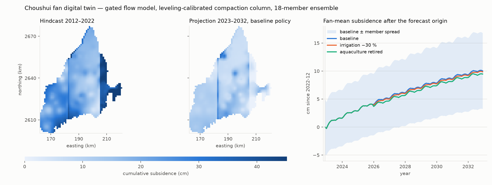

# HydroPhysicsAI

**A differentiable research twin of the Choushui alluvial fan, Taiwan: simulate how pumping affects groundwater heads and land subsidence, and test those simulations against observations.**

[](https://github.com/Rekin226/HydroPhysicsAI/actions/workflows/ci.yml)
[](https://www.python.org/)
[](#how-it-works)
[](LICENSE)

[Project state](docs/superpowers/STATE.md) · [Data](docs/DATA_FORMAT.md) · [Technical writeup](docs/TECHNICAL_WRITEUP.md) · [Model card](MODEL_CARD.md) · [Validation](docs/TWIN_RELEASE.md) · [Updates](docs/TWIN_ASSIMILATION.md) · [Papers](docs/papers/README.md) · [Earlier phase](docs/EARLIER_PHASE.md)

**Current status (September 2026):** the frozen forecast fails the newer groundwater
challenge. An observation-update defect is corrected in an opt-in method, but the
physical forecasts still lose to simple short-term baselines. Policy and subsidence
projections remain research scenarios. See the [latest experiment findings](docs/TWIN_ASSIMILATION.md)
and [validation workflow](docs/TWIN_RELEASE.md).



---

## Overview

The Choushui fan is Taiwan's largest groundwater basin and its most serious subsidence
problem: unmetered irrigation pumping from four stacked aquifers, and a ground surface
sinking centimetres a year under the high-speed-rail corridor.

This repository is a physics-based twin of that system. A four-layer groundwater solver
on a 1 km grid is driven by the registered-pump electricity census and rain-minus-ET
recharge, coupled to a visco-elasto-plastic compaction column, and calibrated by gradient
descent through the solver's own adjoint. It takes a pumping policy, runs the aquifer
forward, and animates where and how fast the ground sinks, with a parameter ensemble
around every number.

```
pumping policy ──▶ flow solver ──▶ layer heads ──▶ compaction column ──▶ subsidence ──▶ decision page
```

## Results

### New observations and update experiments

| Evaluation | Result |
|---|---|
| Frozen forecast, January 2023–August 2026; 158 wells | Datum-adjusted head RMSE **2.07 m** vs **1.67 m** for seasonal climatology: **FAIL** |
| Forcing attribution, January 2023–June 2025; 156 wells | Updated pumping improves RMSE from **2.067 to 1.845 m**; adding aligned weather gives **1.848 m**, still behind climatology at **1.630 m** |
| Observation-update comparison; 155 wells, 4,370 common well-months | Existing update **1.963 m** → residual update **1.723 m** → bounded storage sensitivity **1.600 m**; seasonal persistence **0.855 m** |
| Longer one-month-ahead replay, January 2023–August 2026; 157 wells, 5,908 common well-months | Seasonal persistence **0.845 m**, previous-month persistence **1.326 m**, hybrid physical/seasonal correction **0.894 m** |

The update audit found that reconstructing an entire head field from observations can
move the model even when it predicts every observed well perfectly: up to **19.73 m**
at an unobserved grid cell in the fixed-point test. The new residual update spreads
only observation errors and leaves a perfectly predicted state unchanged. It is
available through `forward.nudge_to_observations(..., method="innovation")`; the
historical default remains available for reproducing existing artifacts.

Seasonal persistence carries the previous month's departure from the historical
seasonal mean into the next month. It remains the strongest tested short-term baseline.
Increasing storage improves observation retention, but does not establish the true
aquifer storage or validate policy responses. The hybrid's small advantage with known
pumping in the shorter replay is uncertain and does not persist in the longer replay.

These are retrospective comparisons with different matched observation subsets;
scores across rows are not directly comparable. Recorded future pumping is used in
the forcing and physical-update experiments; the longer replay uses climatological
future forcing. See [methods, limitations and reproduction](docs/TWIN_ASSIMILATION.md).
The viewer retains the frozen research scenario; these experiments do not replace it.

**One diagnosis runs through both studies.** On the new 2023–2025 data the model's month-to-month
head variability is too small (median well-level standard deviation 0.42 m with updated
pumping against 1.19 m observed). In the 2012–2022 cross-validation the same damping
appears at wells the model never saw (simulated swings about 0.6 of observed, about 0.25 on
the upper fan), and combining the model with interpolation of its residuals adds nothing
over interpolation alone (+0.635 vs +0.654 for per-layer IDW). Storage, river, canal-water,
layered-aquifer and stress-radius variants were each screened and none removes it
([STATE.md §0](docs/superpowers/STATE.md)). The transient response, not the calibration,
is the next thing to change.

### Earlier calibration and scenario results

| | test | result |
|---|---|---|
| **Held-out years** | fit 2012–2019, free-run 2020–2022, 147 wells, after each well's fitted-period datum; must come within 1.25x of climatology plus trend and match its shape | **PASS**, ratio 1.11, shape R² +0.45 vs +0.36 |
| **Unseen wells, head changes** | 5 site-grouped folds, each series de-meaned, against inverse-distance interpolation | FAIL, R² +0.34 vs +0.61 (the previous model: −1.43) |
| **Unseen wells, absolute level** | same folds, raw heads | FAIL, R² +0.64 vs +0.70 (the previous model passed, +0.80) |
| **Compaction column** | 798 leveling benchmarks, site-grouped 5-fold | **+0.652** out of fold |
| **Full chain hindcast** | 798 leveling sites, 36-member ensemble | R² **+0.639**, RMSE 5.7 cm |
| **Projection 2023–2032** | fan-mean subsidence ± ensemble | 2.9 ± 0.6 cm baseline · 1.9 with irrigation cut 30 % · 1.6 with aquaculture retired |
| **Creep uncertainty** | same, with a 30-year creep ceiling | baseline 3.2 cm; policy effects move by under 0.05 cm |
| **Policy timing** | when the avoided subsidence arrives | within months, then flat: the policy gives a one-time rebound and does not slow the ongoing 0.3 cm/yr sinking (the previous model slowed it; untested which is right). Assumes heads set no new minimum after 2026 |
| **Re-run cost** | 36 members × 3 policies × 21 years | about 50 min on one GPU (the FNO surrogate, 13–34× faster, was trained on the previous model and needs retraining) |

Earlier calibration verdicts, including failed configurations, are recorded in
[`docs/superpowers/STATE.md`](docs/superpowers/STATE.md) §0. The newer challenges and
update experiments are documented in [TWIN_RELEASE.md](docs/TWIN_RELEASE.md) and
[TWIN_ASSIMILATION.md](docs/TWIN_ASSIMILATION.md).

**What the model is.** Each monitoring well carries a learned constant offset (its
*datum*): a 1 km cell cannot hold the 30 m vertical head differences measured inside
single well nests on the upper fan, and asking the physics to fit those levels spoiled
its dynamics. The datum sits in the comparison with observations only; it never enters
the solver, the compaction column or the projections. With it, the model is the first
to pass the held-out-years test, and its subsidence skill rose.

**What it is not.** At wells it never saw, it predicts both head changes and absolute
levels worse than simple interpolation. It supports conditional policy exploration;
its intervention effects remain unvalidated. The 14 multi-layer compaction wells, an independent check, lost the skill
they had under the previous model (+0.01 against +0.30). The pumping stress is physical
(efficiency 0.5, 40 m extra head, irrigation return flow), with each cell's electricity
spread over a learned radius. The previous model needed 10 km, at its bound; with the datum
the radius is no longer identified (2.7 km in the full fit, 0.5-10 km across folds), which
says the wide radius was compensating for the level misfit. An earlier
projection of 10.7 cm was about half artefact; that is fixed (state doc §0b).

## Data

The calibration uses real observations on the 2,144 km² fan, aggregated monthly for
2012–2022. Only a synthetic sample ships with the repository; the cache is rebuilt from the WiseEnvr API with
`hydrophysics.twin.fetch_amp` (credentials from the environment only).

| source | size | role |
|---|---|---|
| Water Resources Agency monitoring wells | 174 wells, 4 aquifers, hourly | heads: calibration target and assimilation |
| Taiwan Power Company pump census + electricity | 116,769 pumps, 26 M meter-months | abstraction forcing |
| Rain gauges + ERA5 ET₀ | 26 gauges, daily | recharge |
| Leveling benchmarks | 798 sites, 7,539 surveys | subsidence calibration and validation |
| Multi-layer compaction wells | 14 sites | independent compaction check |
| NLSC tile service | orthophoto and topographic base, 252 tiles at zoom 13 | the ground the viewer recognises |
| SRTM 1 arc-second | terrain over the fan, −5 to 194 m | real elevation, replacing interpolated well collars |

The last two are fetched by `python -m hydrophysics.twin.basemap`; both are public and need
no credentials. Interpolating 279 well collar elevations had put the fan a median 5 m too
low and as much as 83 m out at the foothills.

The newer local groundwater cache covers 158 wells through September 2026; evaluations
use complete months through August. Available pumping records extend through July 2025,
compaction through May 2025, and leveling through 2021. The weather experiment uses
historically aligned Open-Meteo rainfall and ET₀. These sources have different coverage
and freshness; the compaction refresh is not an independent new holdout. Downloaded
measurements and experiment caches remain local and are excluded from Git.


## Quickstart

```bash
pip install -e ".[gpu,viz,explorer,dev]"
export HYDROMIND_GW_DATA=$PWD/chou-shui-data/data

# calibrate the flow model and run its gate with the deliverable's recipe (GPU, about 5 h
# for the full fit; the 5 folds can run as parallel jobs with --only-fold K + merge_folds)
python -m hydrophysics.twin.calibrate_flow --param-mode zonal --epochs 500 --n-folds 5 \
    --fix-eta 0.5 --fix-head-extra 40 --pump-split --return-flow --l-min 1e-4 \
    --learn-spread --spread-max-km 10 --ic-merged-proximal --ground-elev dem \
    --zone-boundaries 205,182,208 --log-t-min-proximal 58 --well-datum fit --well-datum-sd 5 \
    --device cuda --compile-matvec --out results/twin_runs/my_run

# calibrate the compaction column on the gated heads (leveling target)
python -m hydrophysics.twin.calibrate_coupled --theta results/twin_runs/my_run/stage3_theta.json \
    --target leveling --configs zonal --hpc0-guard-days 365 --out results/twin_runs/my_run/coupled

# run a policy forward with the fold ensemble, and render it
python -m hydrophysics.twin.forward --theta results/twin_runs/my_run/stage3_theta.json \
    --theta results/twin_runs/my_run/stage3_fold_thetas.json \
    --scenario "cut30:irrigation=0.7@2026-01" --horizon 120 \
    --column-hpc0-fast-days 365 --column-heads free --restart-taper-km 5 --apex-hold calibrated \
    --save-members yearly \
    --vep-json results/twin_runs/my_run/coupled/vep_zonal_leveling.json --out results/twin_forward/cut30
python -m hydrophysics.twin.viewer_app --forward results/twin_forward/cut30.npz \
    --out results/twin/my_app.html
```

`pytest -q` runs the test suite on CPU in about 12 minutes (CI runs plain `pytest`).

### The application

To view the committed page without calibration or data downloads:

```bash
python -m http.server 8000 --bind localhost --directory results/twin
```

Open [the local twin](http://localhost:8000/twin_app.html). Rebuilding the page requires
the local model artifacts:

```bash
python -m hydrophysics.twin.viewer_app --forward results/twin_forward/datum_gate.npz \
    --basis results/twin_forward/response_basis_datum.npz --out results/twin/twin_app.html
```

`results/twin/twin_app.html` is a research scenario page: one self-contained file of
about 2.2 MB, with its 3D renderer bundled for offline use. It opens on a basin overview
and, on desktop, a schematic four-aquifer scene. A generated headline and six tiles compare the current policy with
business as usual: subsidence avoided by 2032 with its 36-run range, area sinking faster
than a threshold, the high-speed-rail gradient, layer-2 head recovery, the pumping energy
given up, and how many runs agree. Below them sit a 2D map of the policy's change from
baseline, drawn on a fixed symmetric scale, and a linked time series. The series marks the
fitted and projected periods and has a policy-minus-baseline panel. Historical validation
dates remain separate from future projection years. A slider per
water-use class and a 2026/2030 start set the policy. When the policy matches a solved run
the page uses the full 36-run fields; otherwise it builds the result from the per-class
response basis and prints that fast estimate's error. Tabs hold township small multiples
(low-confidence townships flagged from the leveling support), the THSR profile, a
cross-section, pinned-policy comparison and "where the model is trusted". The 3D exploded
block is a drawer, opened automatically on desktop and on demand on mobile. A five-step story mode guides first-time
readers, and the page offers EN/中文, keyboard control, table views and CSV/PNG export.
The known limits from `docs/superpowers/STATE.md` are named next to the numbers they
qualify. Rail and river lines are OpenStreetMap traces (`python -m hydrophysics.twin.app.geo`,
committed under `hydrophysics/twin/app/geodata/`).

The new 2023–August 2026 groundwater challenge gives datum-adjusted RMSE **2.07 m**
against **1.67 m** for seasonal climatology (158 wells). The current frozen forecast
does not beat this baseline. Pass `--challenge results/twin/new_data_challenge/report.json`
to include that report in a rebuilt page; the report must match the forward file's hash.
See [release and validation workflow](docs/TWIN_RELEASE.md) for data ingestion, independent
MODFLOW checks, browser acceptance, and atomic local releases.

The older Plotly viewer (`explorer3d`) still builds if you want a quick figure.

## How it works

- **Solver.** Five-point finite volume, backward Euler, four aquifers with leakance between
  them, general-head boundaries on the coast and the mountain front. The linear solve is
  matrix-free conjugate gradient in float64; gradients come from an implicit-function
  adjoint, so memory does not grow with the rollout.
- **Forcing.** Electricity converts to abstraction through the pump's own hydraulics, with
  the lift taken from the model's evolving head. The census is de-duplicated across shared
  meters and screened against rated motor capacity. Recharge is rain minus ET₀.
- **Calibration and gates.** Zonal parameters (proximal, mid, distal) fitted by Adam
  through the adjoint. The flow gate is site-grouped k-fold against inverse-distance
  interpolation; the column gate is site-grouped k-fold over the leveling network.
- **Forward twin.** Hindcast, observation nudging at the forecast origin and optionally
  through the record, climatological forcing under named policies, and an ensemble over
  fold fits, Laplace-posterior draws and perturbed initial fields. An opt-in residual
  update uses the same cell/layer sampling and fixed well datum as scoring; assimilation
  increments are separate from physical recharge and pumping fluxes.
- **Surrogate.** A PhysicsNeMo Fourier neural operator trained on the calibrated solver,
  for policy sweeps and large ensembles.

Modules live under `hydrophysics/twin/`; each file's docstring states what it does and
why.

**Hardware.** Everything here runs on a single GPU server: one NVIDIA Quadro RTX 6000
(Turing, sm_75, 24 GB), torch 2.11 on CUDA 12.8, PhysicsNeMo 2.2.1, Ubuntu, long jobs in
tmux. Calibration takes about 35 hours per gate; a policy run takes minutes.

The solver is float64 throughout and uses no mixed precision, because the conjugate-
gradient solve needs the precision, not because of speed. Measured on this card with a
4096-cube matmul:

| precision | TFLOP/s | used for |
|---|---|---|
| fp16 | 61.9 | nothing (accuracy) |
| fp32 | 9.1 | the FNO surrogate |
| bf16 | 5.3 | nothing: Turing has no bf16 tensor cores, so it is slower than fp32 |
| fp64 | 0.32 | the flow solver |

The flow solver is bound by kernel launches rather than arithmetic (a float64 matvec takes
257 µs against 250 µs in float32), so the slow fp64 rate costs little. An earlier figure
of 51× over CPU was measured on an older solver and is being re-measured; a recent check on
the current fit gave about 36 s per epoch on the GPU against about 70 s on 4 CPU threads.
Because one job leaves the GPU mostly idle, NVIDIA MPS runs three fits side by side at
2.86× the throughput of one. A newer card would help the surrogate far more than the solver. Stack decisions and the full constraint list are
in `docs/GPU_SERVER.md`.

## Limits

- The newer groundwater challenge fails, and revised physical updates still lose to
  seasonal persistence. A prospectively frozen evaluation, independent compaction
  validation, calibrated predictive uncertainty and observed intervention responses
  remain outstanding.
- At wells it never saw, the model is worse than interpolation on head changes (+0.34 vs
  +0.61) and on absolute level (+0.64 vs +0.70), worst on the upper fan, whose deep layers
  have one well between them. It passes the held-out-years test only after each well's
  datum; its absolute heads at a well carry that offset. Slow storage, canal deliveries,
  river boundaries and a layered upper-fan aquifer were each screened and rejected.
- Simulated head swings are too small, both on the new 2023–2025 data and at unseen wells
  in 2012–2022; no screened variant fixes it (see Results).
- The 2022 head recovery after the drought is missed by every model tried. Canal deliveries
  with the 2021 curtailment and 2022 resumption explain about a quarter of it.
- Whether a pumping cut slows the sinking or only rebounds it cannot be tested on the
  2012–2022 record, because heads never recovered above their earlier minimum; the
  avoided-subsidence numbers assume no new minimum after 2026.
- The pumping-stress spread radius is not identified (0.5-10 km across folds); the
  ensemble carries that spread. Policy sensitivities are consequences of a tested model,
  not validated forecasts.
- The mid-zone viscous time constant reaches the length of the record; a 30-year ceiling
  fits leveling equally well and adds 0.3 cm to the baseline projection (shown as a range).
- The 14 multi-layer compaction wells lost the skill they had under the previous model.
- The per-zone column produces a subsidence step at the 182 km mid/distal line that the
  leveling data do not show; the app marks it. Smoothly banded columns remove it only by
  becoming degenerate (they lose the compaction wells), so they were rejected.
- The posterior is a local Laplace approximation (`--bounded truncnorm` samples parameters
  at a bound).

## Earlier phase

The project began (2026-06) as a benchmark of one physics-informed neural operator across
61 curated wells against per-well gray-box ODEs, with an assimilated forecaster, a PINN
head field and a 2D explorer. That work is kept in full in
[`docs/EARLIER_PHASE.md`](docs/EARLIER_PHASE.md). It is no longer the headline: the twin
runs on a denser, layer-resolved dataset with the pumping forcing and the subsidence
network the operator benchmark never had, and its gates are physical rather than a
comparison with a baseline scored elsewhere.

## Repository

```
hydrophysics/twin/       the twin: grid, boundaries, flow, pumping, compaction, calibration,
                         forward, uncertainty, surrogate, scoring (kfold_scores, drift_diag),
                         validation and updates (challenge, assimilation, update_experiment),
                         the decision page (viewer_app, app/), fetch_amp
hydrophysics/            earlier-phase models, baselines, metrics, forecaster, explorer
docs/superpowers/        design specs, plans and the state ledger
docs/papers/             planned papers: target venues, evidence and gaps
results/twin/            published gate results and the rendered viewer
tests/                   CPU-only test suite
```

## Contributing

Contributions are welcome. See [CONTRIBUTING.md](CONTRIBUTING.md) for the dev setup,
the GPU install and the evaluation rules, and the
[issues](https://github.com/Rekin226/HydroPhysicsAI/issues) for claimable work.

## Author and license

Abdoul Rachid Ouedraogo, Ph.D., hydrogeology and AI. Also: [AquaScope](https://github.com/Rekin226/aquascope).
MIT, see [LICENSE](LICENSE).
